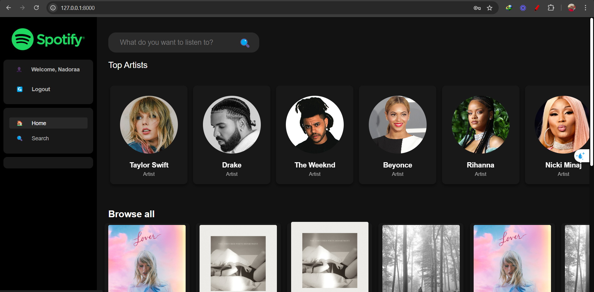
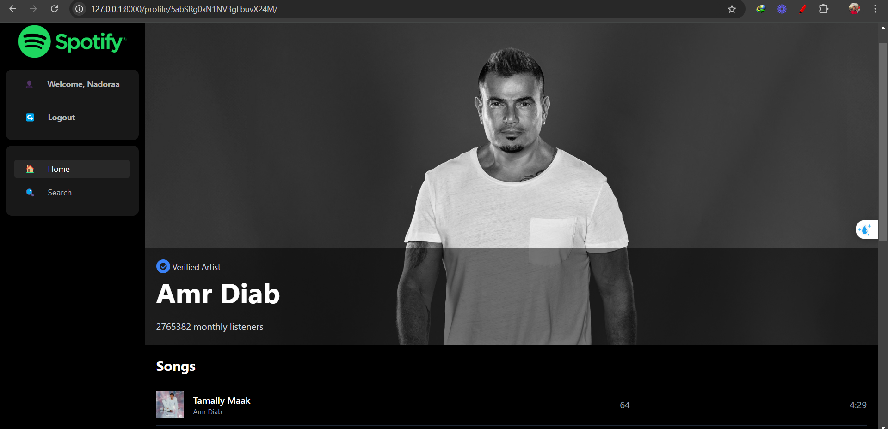
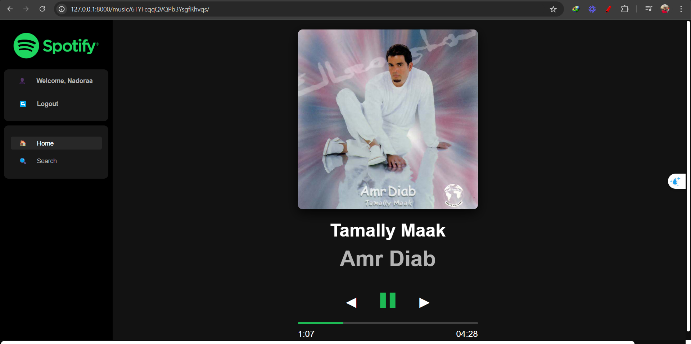
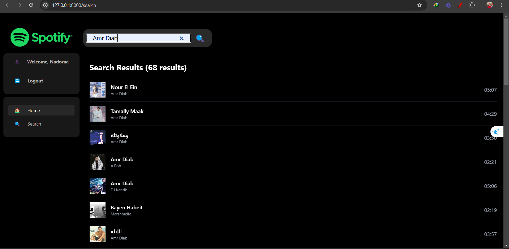
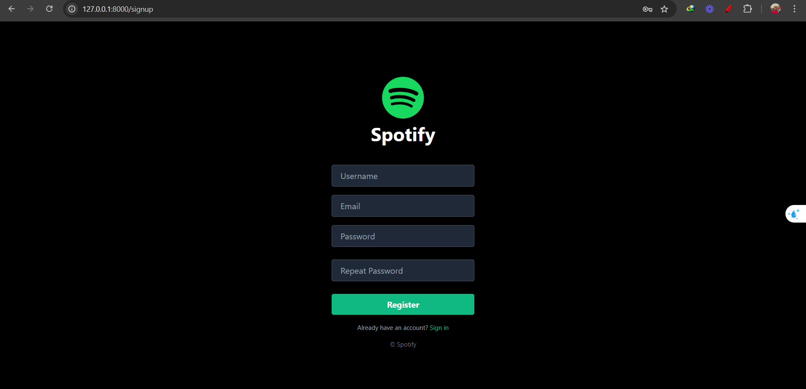
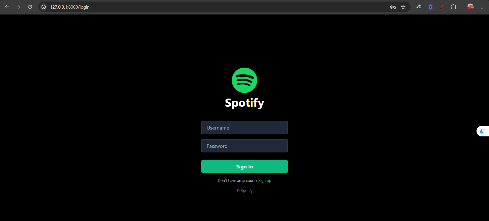

# Spotify Clone

This project is a **Spotify Clone** built using **Django** as the backend framework, **PostgreSQL** as the database, and **HTML/CSS/JavaScript** with **Tailwind CSS** for the front end. The app replicates some of the key features of Spotify, including music search, playlists, and more, using the **Spotify API** for retrieving music data.



## Features

- **User Authentication:** Sign up, log in, and log out functionality.
- **Music Search:** Search for tracks, artists, or albums using the Spotify API.
- **Spotify API Integration:** The app uses a custom token creation mechanism to access Spotify's API for music data retrieval.
- **Responsive Design:** Fully responsive layout using Tailwind CSS.
- **Dynamic Content:** Real-time updates of playlists, search results, and tracks.
- **PostgreSQL Integration:** For efficient and scalable database management.

## Tech Stack

- **Backend:** Django (Python)
- **Frontend:** HTML, CSS, JavaScript, Tailwind CSS
- **Database:** PostgreSQL
- **API:** Spotify API (OAuth for token creation)
- **Version Control:** Git & GitHub

## Installation

### Prerequisites
Ensure that you have the following installed on your machine:

- Python 3.x
- PostgreSQL
- Django
- Node.js and npm (for managing JavaScript dependencies)

### Steps to Set Up the Project

1. **Clone the repository:**
   ```bash
   git clone https://github.com/Nader-Mamdouh/Django-Spotify-Clone.git
   cd spotify-clone
2. **Set up a virtual environment:**
   ```bash
   python -m venv env
   env\Scripts\activate
   pip install -r requirements.txt
   
3. **Configure PostgreSQL:**
   ```bash
   python manage.py makemigrations
   python manage.py migrate
4. **Obtain Spotify API credentials:**
   ```bash
   SPOTIFY_CLIENT_ID=<your-client-id>
   SPOTIFY_CLIENT_SECRET=<your-client-secret>
5. **Token Creation for Spotify API:**
   ```bash
   The app includes a token creation mechanism to access the Spotify API. It fetches an OAuth token using the client credentials
   and uses this token to make requests to the Spotify API for search and other features.   
6. **Run the server:**
   ```bash
   python manage.py runserver






